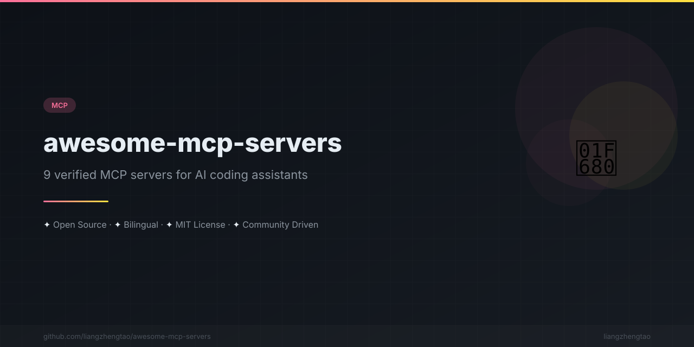

[中文版](README.zh.md)
n<div align="center">



</div>


<div align="center">

# 🚀 Awesome MCP Servers

**The MCP ecosystem for Cursor, Claude Code, and Kimi Code. One config file. Real superpowers.**

[](https://awesome.re)
[](CONTRIBUTING.md)
[](LICENSE)
[](#servers)

<br/>

[What is MCP?](#what-is-mcp) • [Servers](#servers) • [Quick Start](#quick-start) • [Categories](#categories) • [FAQ](#faq) • [Contributing](CONTRIBUTING.md)

</div>

---

## What is MCP?

The **Model Context Protocol (MCP)** is an open standard that lets AI coding assistants connect to external tools, databases, and services. Instead of your AI working in isolation, MCP gives it superpowers — it can query your database, manage your repos, browse the web, and much more.

---

## The Before / After

<table>
<tr>
<td width="50%" valign="top">

### ❌ Without MCP

```
You: "Check our Postgres for the user count"
AI:  "I can't access your database."

You: "Look at the latest issues on GitHub"
AI:  "I don't have access to GitHub."

You: "What does the React docs say about hooks?"
AI:  "My training data may be outdated."
```

</td>
<td width="50%" valign="top">

### ✅ With MCP

```
You: "Check our Postgres for the user count"
AI:  → Queries your DB → "You have 14,832 users."

You: "Look at the latest issues on GitHub"
AI:  → Reads issues → "3 open bugs, 2 feature requests."

You: "What does the React docs say about hooks?"
AI:  → Fetches live docs → "Here's the latest API..."
```

</td>
</tr>
</table>

**MCP turns your AI from a smart autocomplete into a full-stack engineering teammate.**

---

## Servers

| # | Server | Category | Description | Package |
|---|--------|----------|-------------|---------|
| 1 | [Filesystem](servers/filesystem.md) | 📁 Files | Read, write, and manage local files | `@modelcontextprotocol/server-filesystem` |
| 2 | [GitHub](servers/github.md) | 🔧 Development | Repos, issues, PRs, and code search | `@modelcontextprotocol/server-github` |
| 3 | [PostgreSQL](servers/postgres.md) | 🗄️ Databases | Query and explore PostgreSQL databases | `@modelcontextprotocol/server-postgres` |
| 4 | [Redis](servers/redis.md) | 🗄️ Databases | Cache, pub/sub, and key-value operations | `@modelcontextprotocol/server-redis` |
| 5 | [Web Search](servers/web-search.md) | 🌐 Web | Search the web with Brave or Google | `@modelcontextprotocol/server-brave-search` |
| 6 | [Memory](servers/memory.md) | 🧠 Knowledge | Persistent memory and knowledge graph | `@modelcontextprotocol/server-memory` |
| 7 | [Puppeteer](servers/puppeteer.md) | 🌐 Web | Browser automation and web scraping | `@modelcontextprotocol/server-puppeteer` |
| 8 | [Slack](servers/slack.md) | 💬 Communication | Send messages and manage channels | `@modelcontextprotocol/server-slack` |
| 9 | [Context7](servers/context7.md) | 📚 Documentation | Up-to-date library documentation | `@upstash/context7-mcp` |

---

## Categories

| Category | Servers | Description |
|----------|---------|-------------|
| [🔧 Development](by-category/development.md) | GitHub | Code, repos |
| [🗄️ Databases](by-category/databases.md) | PostgreSQL, Redis | Query, store, cache |
| [💬 Communication](by-category/communication.md) | Slack | Messaging |
| 📁 Files | Filesystem | Local file operations |
| 🌐 Web | Web Search, Puppeteer | Search, browser automation |
| 🧠 Knowledge | Memory, Context7 | Persistent context, live docs |

---

## Quick Start

Add an MCP server to your AI coding assistant in under 30 seconds.

### Cursor

1. Create or edit `.cursor/mcp.json` in your project root:

```json
{
  "mcpServers": {
    "filesystem": {
      "command": "npx",
      "args": ["-y", "@modelcontextprotocol/server-filesystem", "/path/to/your/project"]
    }
  }
}
```

2. Restart Cursor. The MCP server icon appears in the bottom status bar.

### Claude Code

```bash
# Add a server with one command
claude mcp add filesystem -- npx -y @modelcontextprotocol/server-filesystem /path/to/your/project

# Verify it's running
claude mcp list
```

### Kimi Code

Configure via `config.toml` in your Kimi Code config directory:

```toml
[mcp_servers.filesystem]
command = "npx"
args = ["-y", "@modelcontextprotocol/server-filesystem", "/path/to/your/project"]
```

---

## Multiple Servers at Once

You can stack as many servers as you need:

```json
{
  "mcpServers": {
    "filesystem": {
      "command": "npx",
      "args": ["-y", "@modelcontextprotocol/server-filesystem", "."]
    },
    "github": {
      "command": "npx",
      "args": ["-y", "@modelcontextprotocol/server-github"],
      "env": {
        "GITHUB_PERSONAL_ACCESS_TOKEN": "ghp_xxxxxxxxxxxx"
      }
    },
    "postgres": {
      "command": "npx",
      "args": ["-y", "@modelcontextprotocol/server-postgres", "postgresql://localhost/mydb"]
    }
  }
}
```

---

## FAQ

<details>
<summary><strong>What is MCP?</strong></summary>

The Model Context Protocol (MCP) is an open standard created by Anthropic that defines how AI assistants connect to external tools and data sources. Think of it as a universal adapter for AI — one protocol, any tool.

</details>

<details>
<summary><strong>Is MCP free?</strong></summary>

Yes. MCP itself is an open protocol (MIT licensed). Individual MCP servers are free to run locally. Some may require API keys for third-party services (e.g., GitHub token, Slack token).

</details>

<details>
<summary><strong>Which AI assistants support MCP?</strong></summary>

As of 2026, MCP is supported by:
- **Cursor** — Full support via `.cursor/mcp.json`
- **Claude Code** — Full support via CLI (`claude mcp add`)
- **Kimi Code** — Full support via `AGENTS.md` or `config.toml`
- **Windsurf**, **Cline**, **Continue** — Growing support

</details>

<details>
<summary><strong>Are MCP servers safe?</strong></summary>

MCP servers run locally on your machine. They only have the permissions you grant them. Always review what a server does before adding it. For production use, restrict file paths and use read-only database connections where possible.

</details>

<details>
<summary><strong>Can I build my own MCP server?</strong></summary>

Absolutely. The MCP SDK is available for [TypeScript](https://github.com/modelcontextprotocol/typescript-sdk) and [Python](https://github.com/modelcontextprotocol/python-sdk). See the [official docs](https://modelcontextprotocol.io) to get started.

</details>

<details>
<summary><strong>How do I troubleshoot a server that isn't working?</strong></summary>

1. Ensure Node.js 18+ (or the required runtime) is installed
2. Try running the command manually in your terminal to see errors
3. Check that required environment variables / API keys are set
4. Restart your AI assistant after changing MCP config

</details>

---

## See Also

| Project | Description |
|---------|-------------|
| [**awesome-ai-rules**](https://github.com/liangzhengtao/awesome-ai-rules) | 20 production-ready AI coding rules |
| [**vibe-check**](https://github.com/liangzhengtao/vibe-check) | `npx vibe-check` — Score your project's AI-readiness |
| [**ai-commit**](https://github.com/liangzhengtao/ai-commit) | `npx ai-commit` — AI writes your commit messages |

## Contributing

We love contributions! See [CONTRIBUTING.md](CONTRIBUTING.md) for how to add a new MCP server.

---

## License

[MIT](LICENSE) — Use it however you want.

---

<div align="center">

**Built with ❤️ by the MCP community**

[⬆ Back to top](#-awesome-mcp-servers)

</div>

---
